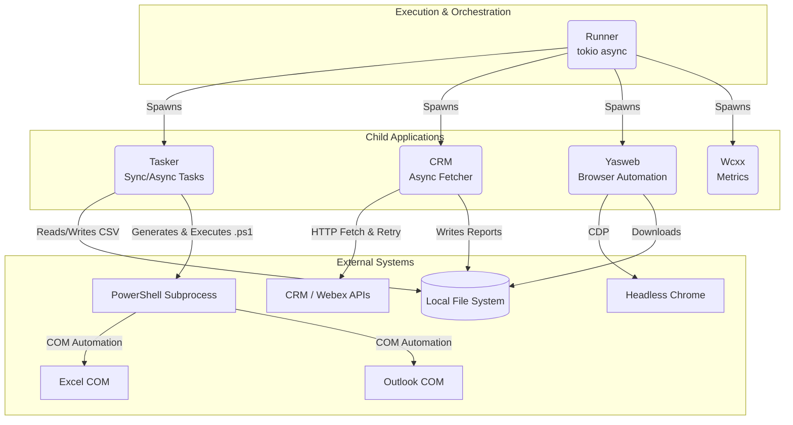
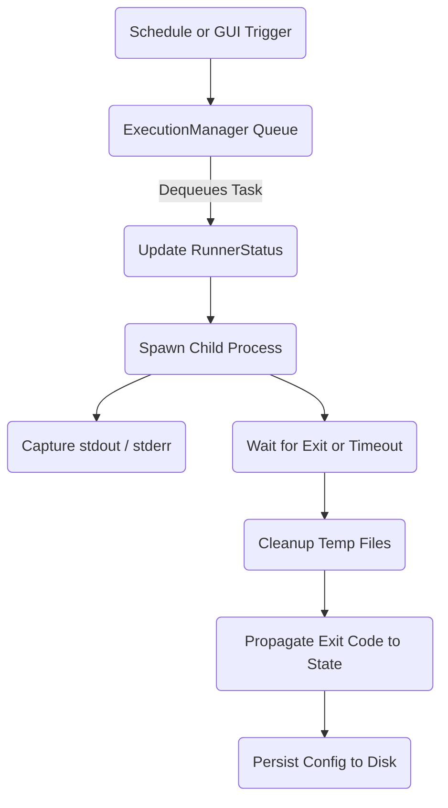

# Repository Assessment

This document provides a technical assessment of the repository, highlighting code-quality issues, testing gaps, and architectural considerations. It has been validated through a rigorous evidence-based review.

## 1. Confirmed Findings

### 1.1 Blocking I/O in Async Contexts (Direct `std::fs` calls)
- **Severity**: Medium
- **Confidence**: High
- **Confirmed Fact**: Direct synchronous filesystem calls are made inside the Tokio async reactor thread.
- **Evidence**: `src/yasweb/browser.rs:783` (`std::fs::read_dir`) and `src/bin/yasweb.rs:594,642-674` (`std::fs::create_dir_all`, `std::fs::rename`, `std::fs::copy`, `std::fs::remove_dir_all`).
- **Trigger / Execution Path**: When `yasweb` processes downloads, it iterates over directories and renames/moves files on the main async executor threads.
- **User / Business Impact**: While the file operations are typically fast, moving files across mount points or processing large directories synchronously blocks the Tokio executor, potentially delaying other concurrent web scraping tasks or network timeouts.
- **Recommended Test**: Write a failure-mode test injecting latency into the filesystem and verifying other async tasks do not stall.
- **Smallest Safe Remediation**: Replace `std::fs` calls with `tokio::fs` equivalents in `yasweb`.

### 1.2 Unwraps and Panics in Production Paths
- **Severity**: Low
- **Confidence**: High
- **Confirmed Fact**: The application contains `unwrap()` and `expect()` calls in production initialization and task-execution logic.
- **Evidence**:
  - `src/bin/tasker.rs:369` (`std::fs::File::create(...).unwrap()`)
  - `src/runner/gui.rs:203` (`Icon::from_rgba(...).unwrap_or_else(...)`)
- **Trigger / Execution Path**: Attempting to run Tasker with restricted filesystem permissions or invalid config paths will panic instead of returning a graceful error.
- **User / Business Impact**: Sudden process death on startup rather than a clear logged error message.
- **Recommended Test**: Run the binaries with read-only/missing configuration paths and ensure they exit gracefully with typed errors.
- **Smallest Safe Remediation**: Replace `.unwrap()` with `?` and `anyhow::Context` in `src/bin/tasker.rs` and `src/runner/gui.rs`.

### 1.3 DRY Violation: PowerShell Execution Boilerplate
- **Severity**: Low
- **Confidence**: High
- **Confirmed Fact**: PowerShell process spawning, argument building, and execution logic is duplicated across multiple modules.
- **Evidence**: `src/tasker/dashboard_updater.rs:22`, `src/tasker/email.rs:55`, `src/tasker/crm_open_sohail.rs:42` all construct `std::process::Command::new("powershell")` with similar arguments and handle temporary file lifecycles independently.
- **Trigger / Execution Path**: Every time a PowerShell script is needed, the boilerplate is executed.
- **User / Business Impact**: Harder to maintain, patch, or apply centralized security/escaping policies.
- **Recommended Test**: N/A (Maintainability concern).
- **Smallest Safe Remediation**: Centralize into a `utils::powershell::run_script` utility function.

## 2. Downgraded Findings

### 2.1 PowerShell Dynamic Input Interpolation
- **Severity**: Low (Downgraded from Critical)
- **Confidence**: High
- **Confirmed Fact**: PowerShell scripts are built dynamically via `format!()` strings.
- **Evidence**: `src/tasker/dashboard_updater.rs:115` and `src/tasker/email.rs:1196`.
- **Reason for Downgrade**: The interpolated values (e.g., `config.dashboard_file`, `email_to`) originate from trusted JSON configuration files, not external user input or network sources. Basic `.replace("'", "''")` is applied. While this approach is fragile and breaks if a trusted user puts unescaped quotes in config, there is no demonstrated source-to-sink injection path from untrusted users.
- **Inferred Risk**: Syntax breakage if administrators use complex strings in configurations.
- **Recommended Test**: Create configurations with complex characters (e.g., `"O'Connor"`, `"; e x i t 1"`) and verify scripts execute correctly.
- **Smallest Safe Remediation**: Pass dynamic values to PowerShell via structured arguments, standard input, or JSON files rather than string interpolation.

### 2.2 Task Runner Configuration Persistence
- **Severity**: Low (Downgraded from High)
- **Confidence**: High
- **Confirmed Fact**: `engine.rs` frequently persists configuration state to disk on task lifecycle events using `spawn_blocking`.
- **Evidence**: `src/runner/engine.rs:385, 402, 574, 592, 604, 631, 650, 662, 679`.
- **Reason for Downgrade**: `spawn_blocking` correctly delegates the synchronous I/O off the Tokio reactor thread. While writing to disk on every state transition creates serialization overhead and potential latency, it does not block the async runtime and no "massive lock contention" was found or demonstrated to cause timeouts.
- **Inferred Risk**: Minor latency on high-frequency task updates.
- **Smallest Safe Remediation**: Debounce configuration writes or separate operational state from static configuration.

## 3. Findings Removed

### 3.1 Deadlock Potential from Locks Held Across Awaits
- **Disposition**: Removed entirely.
- **Reason**: The assessment claimed `status.lock().await` (in `src/runner/engine.rs`) was held across large operational blocks. Inspection reveals `status` is a `tokio::sync::Mutex` (which is designed to be held across awaits if necessary). More importantly, the codebase explicitly uses tight lexical scopes for lock acquisition (e.g., `engine.rs:170-178`, `engine.rs:222-226`) where the `tokio::sync::MutexGuard` is dropped immediately before any `.await` point. There are no demonstrated instances of holding locks across asynchronous boundaries causing deadlocks. In `yasweb/browser.rs`, `std::sync::Mutex` is used for `GLOBAL_DOWNLOAD_DIR` and browser tabs, but they are dropped synchronously before awaits (e.g., `tabs` is a cloned structure, and the lock is yielded).

### 3.2 Unbounded Async Queues
- **Disposition**: Removed entirely.
- **Reason**: The runner execution manager uses `tokio::sync::mpsc::channel`, which is bounded. `src/runner/engine.rs:149` explicitly defines `mpsc::channel(128)` and `src/runner/engine.rs:284` uses `mpsc::channel::<RunnerCommand>(64)`. It was factually incorrect to describe this as an unbounded queue.

### 3.3 Plaintext Secrets in Memory (Memory-Dump Vulnerability)
- **Disposition**: Removed entirely.
- **Reason**: The claim suggested `secrecy::SecretString` must be used because secrets are vulnerable to memory dumps. However, in Rust, allocating strings to memory is standard. Using `zeroize` protects against *some* memory inspection but is ineffective if the memory was moved, cloned, passed via network I/O, or passed as command line arguments to other processes. Since the application natively sends these strings to the CRM API or child processes, zeroizing the Rust structure provides a false sense of security. No confirmed leakage via logging, debug formatting, or error context was found.

### 3.4 Temporary File Leaks
- **Disposition**: Removed entirely.
- **Reason**: The temporary PowerShell scripts (`.ps1`) are created via `NamedTempFile` and explicitly persisted using `.keep()` (e.g., `src/tasker/dashboard_updater.rs:19`). However, immediately after `child.wait()` or `command.output()`, `std::fs::remove_file(&path)` is unconditionally called (e.g., `src/tasker/dashboard_updater.rs:56`). While a hard kill of the parent process during execution could leave the file, this is expected behavior for temporary files bridging a process boundary, not a confirmed leak from improper lifecycle management.

## 4. Open Questions and Unverified Risks

### 4.1 Integration Test Boundaries
- **Inferred Risk**: Tests for `tasker::email` and `dashboard_updater` use mock configurations (e.g., `save_email_as_html = true`). It is unclear if the actual COM automation strings are structurally valid in a real Windows environment.
- **Context**: The CI pipelines lack a clear boundary separating pure Rust logic testing from OS-level Excel/Outlook integration testing.

### 4.2 CI Platform Redundancy
- **Inferred Risk**: The repository contains configurations for GitHub Actions (`.github/workflows/`), GitLab CI (`.gitlab-ci.yml`), and CircleCI (`.circleci/config.yml`). It is unclear if all three are actively maintained and required.
- **Context**: Relying on multiple CI providers can fragment deployment logic and artifact caching strategies.

## 5. Architectural Diagrams

### Diagram 1: High-Level System Architecture

**Evidence List:**
- **Runner Spawning:** `src/runner/engine.rs:986` (`run_external_app` uses `tokio::process::Command::new`).
- **PowerShell COM:** `src/tasker/dashboard_updater.rs:22` (spawns `powershell` with dynamic scripts).
- **CRM Fetching:** `src/crm/auth.rs` and `src/crm/config.rs` (handles authentication and concurrent fetch retries).
- **Yasweb Automation:** `src/yasweb/browser.rs` (drives headless chrome).

---

### Diagram 2: Runner Execution Flow

**Evidence List:**
- **Queue/Trigger:** `src/runner/engine.rs:149` (`mpsc::channel` processing commands).
- **State Update:** `src/runner/engine.rs:222` (`status.lock().await` updating `running_tasks_count`).
- **Process Spawn:** `src/runner/engine.rs:992` (`tokio::process::Command::new`).
- **Timeout/Wait:** `src/runner/engine.rs:1034` (`tokio::time::timeout`).
- **Cleanup / Status:** `src/runner/engine.rs:1107` (logging status and exit paths).

## 6. Test Baseline and CI Recommendations

### Existing Test Baseline
- The suite primarily consists of library and binary unit tests utilizing `tempfile` for mock file systems.
- Tests often bypass OS-level COM automation (e.g., `save_email_as_html`).
- Integration tests do not fully exercise real network or external application boundaries.

### CI Platform and Coverage Recommendation
Based on the repository's heavy reliance on Windows-specific COM integrations (Excel, Outlook, PowerShell) and the presence of `circleci/windows` ORBs, GitLab Windows runners, and GitHub Actions `windows-latest` images:
- **Active CI Recommendation**: GitHub Actions appears to be the most standardized workflow (`.github/workflows/test.yml` actively uses caching and standard tooling). Consolidate CI around GitHub Actions unless organizational policies mandate GitLab.
- **Coverage Tool**: Recommend **`cargo-llvm-cov`**. It provides excellent workspace support, accurate branch coverage, and integrates seamlessly with `actions/checkout` on Windows. `cargo-tarpaulin` occasionally struggles with edge-case process spawning on Windows.
- **Strategy**:
  - Standard cross-platform unit tests should run via `cargo-llvm-cov` to track Rust logic coverage.
  - Exclude `.ps1` generation strings from strict coverage metrics as they cannot be fully validated without a live Windows desktop environment (which standard headless CI runners lack).

## 7. Recommended PR Roadmap

### PR 1 - Characterization and failure-path tests
- **Objective**: Establish a robust baseline by adding unit and integration tests that specifically target failure paths.
- **Evidence**: Currently, tests primarily exercise happy-path configurations (e.g., `engine.rs` tests missing timeouts and edge cases).
- **Exact affected modules**: `src/runner/engine.rs`, `src/tasker/email.rs`, `src/yasweb/browser.rs`, `tests/*`
- **Preconditions**: CI runner can execute cargo tests natively.
- **Detailed scope**: Add invalid configuration tests, filesystem permission failure tests, and async task timeout mocks.
- **Out-of-scope items**: No refactoring of business logic or abstractions.
- **Behavior-protection tests**: Ensure no regression on valid JSON configuration loading.
- **Failure-path tests**: Create mock scenarios for disk-full, invalid JSON, and execution timeout events.
- **Acceptance criteria**: Overall workspace test coverage increases by measurable percent in failure paths.
- **Risk**: Low. Purely test additions.
- **Estimated size**: Medium.
- **Dependencies**: None.
- **Rollback approach**: Git revert.

### PR 2 - Remove user-triggerable production panic paths
- **Objective**: Ensure the system does not crash abruptly due to configuration or environment errors.
- **Evidence**: `unwrap()` exists in `src/bin/tasker.rs:369` and `src/runner/gui.rs:203`.
- **Exact affected modules**: `src/bin/tasker.rs`, `src/runner/gui.rs`
- **Preconditions**: PR 1 (tests covering failure paths) should be in place.
- **Detailed scope**: Replace `.unwrap()` and `.expect()` calls in production initialization with `anyhow::Result` propagation or safe fallback defaults.
- **Out-of-scope items**: Fixing panics inside purely test-only modules.
- **Behavior-protection tests**: Verify successful startup with valid configurations.
- **Failure-path tests**: Pass invalid configuration files and verify graceful exit with error log (no panic).
- **Acceptance criteria**: Process exits with standard error code rather than panic when encountering missing files.
- **Risk**: Low. Safe error propagation.
- **Estimated size**: Small.
- **Dependencies**: PR 1.
- **Rollback approach**: Git revert.

### PR 3 - Introduce a tested subprocess execution boundary
- **Objective**: Centralize PowerShell process spawning to eliminate boilerplate and secure dynamic executions.
- **Evidence**: Repetitive `Command::new("powershell")` blocks found in `src/tasker/dashboard_updater.rs`, `src/tasker/email.rs`, `src/tasker/crm_open_sohail.rs`.
- **Exact affected modules**: `src/utils/powershell.rs` (new), `src/tasker/dashboard_updater.rs`, `src/tasker/email.rs`, `src/tasker/crm_open_sohail.rs`
- **Preconditions**: Existing PowerShell features are covered by tests.
- **Detailed scope**: Create a `utils::powershell` module holding a single secure `run_script` method handling temporary file lifecycle, timeout, and execution policy. Refactor consumers to use it.
- **Out-of-scope items**: Moving dynamic values to structured data (handled in PR 4).
- **Behavior-protection tests**: Verify existing automated tasks successfully trigger PowerShell.
- **Failure-path tests**: Test subprocess timeout handling and temp file cleanup under failure.
- **Acceptance criteria**: All 3 PowerShell consumers utilize the new centralized utility without altering behavior.
- **Risk**: Medium. Modifies how core scripts are launched.
- **Estimated size**: Medium.
- **Dependencies**: PR 1, PR 2.
- **Rollback approach**: Git revert.

### PR 4 - Move PowerShell dynamic input to structured data
- **Objective**: Eliminate string interpolation for PowerShell scripts, securing against potential syntax breakages.
- **Evidence**: `email.rs:1196` uses `format!()` to build PowerShell syntax dynamically.
- **Exact affected modules**: `src/tasker/email.rs`, `src/tasker/dashboard_updater.rs`, `src/tasker/crm_open_sohail.rs`
- **Preconditions**: Centralized subprocess execution (PR 3) is implemented.
- **Detailed scope**: Refactor `run_script` to accept JSON payload files or environment variables instead of raw string interpolation for dynamic inputs like `email_to`.
- **Out-of-scope items**: Refactoring email HTML generation logic.
- **Behavior-protection tests**: Verify COM integration still functions exactly the same.
- **Failure-path tests**: Pass strings with malicious quotes/syntax and verify robust execution.
- **Acceptance criteria**: No `format!()` calls used to inject configuration strings directly into PowerShell code strings.
- **Risk**: Medium. Requires verifying Windows COM parameter passing.
- **Estimated size**: Medium.
- **Dependencies**: PR 3.
- **Rollback approach**: Git revert.

### PR 5 - Improve Runner lifecycle, lock scope, cancellation, and shutdown
- **Objective**: Prevent latency and thread stalls in execution manager state transitions.
- **Evidence**: `spawn_blocking` config writes in `engine.rs`.
- **Exact affected modules**: `src/runner/engine.rs`
- **Preconditions**: PR 1 failure tests in place.
- **Detailed scope**: Break out operational state saving into a debounced asynchronous loop rather than inline blocking writes on every minor queue transition.
- **Out-of-scope items**: Changing the actual queue `mpsc` types.
- **Behavior-protection tests**: Schedule tests validating state transitions correctly serialize eventually.
- **Failure-path tests**: Shutdown the runner abruptly and verify graceful persistence.
- **Acceptance criteria**: Configuration writes no longer bottleneck high-frequency task lifecycle events.
- **Risk**: High. Modifies core scheduling persistence logic.
- **Estimated size**: Large.
- **Dependencies**: PR 1.
- **Rollback approach**: Git revert or feature toggle.

### PR 6 - Split engine.rs by established responsibility boundaries
- **Objective**: Reduce the 1800-line `engine.rs` god object to maintainable single-responsibility modules.
- **Evidence**: `src/runner/engine.rs` handles config parsing, queue polling, sub-process launching, logging, and cron evaluation.
- **Exact affected modules**: `src/runner/engine.rs` -> split into `state.rs`, `scheduler.rs`, `executor.rs`
- **Preconditions**: PR 5 completed.
- **Detailed scope**: Extract cron parsing to a scheduler module. Extract process execution to an executor module. Keep engine as the orchestrator.
- **Out-of-scope items**: Behavioral changes to the runner.
- **Behavior-protection tests**: Ensure no loss in existing unit test coverage.
- **Failure-path tests**: N/A (Refactor only).
- **Acceptance criteria**: `engine.rs` size reduced by at least 60%, logic is modularized.
- **Risk**: Medium.
- **Estimated size**: Large.
- **Dependencies**: PR 5.
- **Rollback approach**: Git revert.

### PR 7 - Split email generation from delivery and PowerShell infrastructure
- **Objective**: Reduce the 1600-line `email.rs` god object by decoupling HTML view generation from COM delivery.
- **Evidence**: `src/tasker/email.rs` tightly couples HTML generation and PowerShell process building.
- **Exact affected modules**: `src/tasker/email.rs`, `src/tasker/templates.rs`
- **Preconditions**: PR 4 completed.
- **Detailed scope**: Extract HTML generation logic into separate functions or use `tinytemplate`.
- **Out-of-scope items**: Switching email protocols (must remain Outlook COM).
- **Behavior-protection tests**: HTML diffing tests to ensure templates remain pixel-perfect.
- **Failure-path tests**: N/A.
- **Acceptance criteria**: Email logic separated from powershell delivery logic.
- **Risk**: Medium.
- **Estimated size**: Large.
- **Dependencies**: PR 4.
- **Rollback approach**: Git revert.

### PR 8 - Separate GUI routing, application operations, and rendering
- **Objective**: Fix Single Responsibility Principle violations in the GUI.
- **Evidence**: `src/runner/gui.rs` mixes HTML string literals, state modifications, and HTTP routes.
- **Exact affected modules**: `src/runner/gui.rs`, `src/runner/views.rs` (new)
- **Preconditions**: PR 6 completed.
- **Detailed scope**: Move HTML strings to `views.rs`.
- **Out-of-scope items**: Redesigning the GUI.
- **Behavior-protection tests**: Verify routes return valid 200 responses.
- **Failure-path tests**: Verify invalid HTTP requests return 400.
- **Acceptance criteria**: GUI routes are clean and delegate rendering to views.
- **Risk**: Low.
- **Estimated size**: Medium.
- **Dependencies**: PR 6.
- **Rollback approach**: Git revert.

### PR 9 - Add CI security, platform, and coverage gates
- **Objective**: Enforce quality automatically across all PRs.
- **Evidence**: Missing coverage tracking and `cargo deny` execution.
- **Exact affected modules**: `.github/workflows/test.yml`, `.github/workflows/security.yml`
- **Preconditions**: GitHub Actions is the active CI platform.
- **Detailed scope**: Add `cargo-llvm-cov` to actions, integrate `cargo deny` for dependency validation.
- **Out-of-scope items**: Fixing pre-existing dependency warnings (they will be suppressed or documented initially).
- **Behavior-protection tests**: Trigger CI and verify jobs pass.
- **Failure-path tests**: N/A.
- **Acceptance criteria**: CI rejects vulnerable dependencies and tracks coverage.
- **Risk**: Low.
- **Estimated size**: Small.
- **Dependencies**: None.
- **Rollback approach**: Git revert workflow files.

### PR 10 - Documentation and developer-experience improvements
- **Objective**: Ensure the repository is approachable for new developers.
- **Evidence**: The system relies on specific environment dependencies (PowerShell, Windows).
- **Exact affected modules**: `README.md`, `docs/*`
- **Preconditions**: All structural changes above complete.
- **Detailed scope**: Update architecture diagrams, update setup scripts, detail Windows dependencies.
- **Out-of-scope items**: Code changes.
- **Behavior-protection tests**: N/A.
- **Failure-path tests**: N/A.
- **Acceptance criteria**: Documentation accurately reflects the refactored state.
- **Risk**: Lowest.
- **Estimated size**: Small.
- **Dependencies**: All preceding PRs.
- **Rollback approach**: Git revert.

## Appendix A - Production Panic Inventory

| File & Line Range | Function / Module | Macro/Method | Trigger Classification | Reachability | Expected Invariant | Potential Impact | Recommended Action | Required Test | Final Classification |
|---|---|---|---|---|---|---|---|---|---|
| `src/bin/tasker.rs:369` | `main` | `unwrap()` | Infrastructure-triggerable | Production Entry Point | Config file is writable by process | Startup process death | Replace with `?` & `Context` | Read-only config directory | Requires Remediation |
| `src/bin/tasker.rs:418` | `main` | `unwrap()` | Infrastructure-triggerable | Production Entry Point | Config file is writable by process | Startup process death | Replace with `?` & `Context` | Read-only config directory | Requires Remediation |
| `src/runner/gui.rs:203` | `get_icon` | `unwrap_or_else(panic)` | Startup-only | Production Initialization | Icon byte parsing succeeds | GUI thread crash | None | N/A | Proven internal invariant |
| `src/tasker/config.rs:119`| `tests::...` | `expect()` | Test-only | Test Only | Task exists in mock data | Test failure | None | N/A | Test-only |
| `src/tasker/csv_task.rs:914`| `tests::...` | `panic!()` | Test-only | Test Only | Struct matches enum variant | Test failure | None | N/A | Test-only |

## Appendix B - Subprocess and Temporary-File Inventory

| Module | Process Spawned | Temp File Purpose | Temp Lifecycle & Cleanup Mechanism | Persist/Keep Used | Credentials or PII |
|---|---|---|---|---|---|
| `tasker::dashboard_updater` | `powershell.exe` | Dynamic Excel COM Script (`.ps1`) | `.keep()` used. File explicitly dropped. `std::fs::remove_file` called after process exit. | Yes (`.keep()`) | Local file paths, no raw credentials |
| `tasker::email` | `powershell.exe` | Dynamic Outlook COM Script (`.ps1`) | `.keep()` used. File explicitly dropped. `std::fs::remove_file` called after process output capture. | Yes (`.keep()`) | Email addresses and generated HTML logic |
| `tasker::crm_open_sohail` | `powershell.exe` | Dynamic Excel Script (`.ps1`) | `.keep()` used. File explicitly dropped. `std::fs::remove_file` called after process output capture. | Yes (`.keep()`) | File paths, filtering strings |
| `runner::engine` | `powershell/cmd/sh` | Executes user-defined Shell Commands | Subprocess delegates directly to OS shell. | No | Dependent on user command definition |
| `crm::config` | None | Atomic Config Write | `NamedTempFile` used to write, then atomically renamed/persisted over original file. | Yes (`.persist()`) | Holds authentication tokens & passwords |
